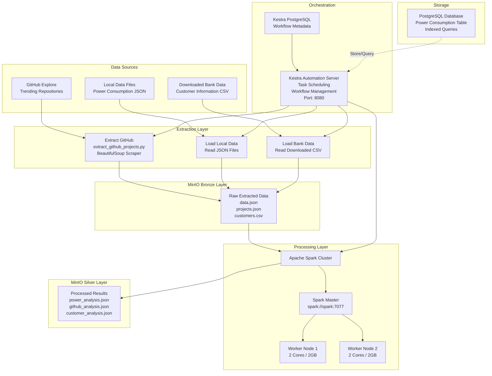

# ETL project

## Stacks

- **Docker**: Containerisation
- **Kestra**: Automation plateform
- **Spark**: Data processing
- **Minio**: Storage
- **Mailpit**: Email testing and debugging

## How to Run

### Initial Setup

Create the required Docker network:

```bash
docker network create etl-net
```

### Start the Stack

Launch all services:

```bash
docker compose up -d
```

### Access the Platforms

Once all containers are running, access the web interfaces:

- **Kestra Dashboard**: <http://localhost:8080>
- **Spark Web UI**: <http://localhost:30081/>
- **MinIO Console**: <http://localhost:9001>
- **Mailpit Email UI**: <http://localhost:8025>

### Credentials

```yaml
kestra:
  email: admin@local.host
  password: Password123!

minio:
  username: minio
  password: minio_password
```

## Project Description

This project is an automated ETL pipeline that extracts, transforms, and analyzes data from multiple sources. The pipeline collects power consumption data, GitHub trending repositories, and customer bank data from the internet, processes them using Apache Spark, and stores the results for further analysis.

## Data Sources

The system processes data from three main sources:

1. **Local Power Consumption Data** - Historical power consumption records for three zones with environmental metrics including temperature, humidity, wind speed, and solar diffuse flows.

2. **GitHub Explore Page** - Trending GitHub repositories scraped in real-time to identify popular open-source projects, their programming languages, topics, and update frequency.

3. **Downloaded Bank Customer Data** - Customer information downloaded from internet sources containing customer profiles, credit scores, geography, age, tenure, balance, and churn status.

## How Data is Processed

Data flows through the system in distinct stages:

1. **Extraction** - Data from external sources is extracted using Python scripts. GitHub data is scraped using BeautifulSoup. Local files and downloaded customer data are read directly. All raw data goes to MinIO bronze bucket.

2. **Processing** - Data from bronze bucket is processed by Apache Spark cluster. Spark transforms raw data, extracts features, aggregates statistics, and performs calculations. Multiple worker nodes handle the computation in parallel.

3. **Analysis Results** - Processed data is saved to MinIO silver bucket as analysis files. These files contain final statistics, rankings, trends, and predictions ready for insights.

4. **Orchestration** - Kestra manages the entire workflow, scheduling extractions, triggering Spark jobs, monitoring completion, and handling failures.

## System Architecture

The complete infrastructure consists of multiple interconnected services working together to handle the entire data pipeline:



## MinIO Storage Structure

Data is organized in MinIO by type and date for easy tracking and retrieval.

### Bronze Bucket

Raw extracted data from all sources stored by date. No transformations applied.

**Bank Customer Data**
- Path: `file/{YYYY-MM-DD}/data.json`
- Source: Downloaded from internet (CSV converted to JSON)
- Updated: Daily

**Power Consumption Data**
- Path: `db/{YYYY-MM-DD}/data.json`
- Source: PostgreSQL database
- Updated: Daily

**GitHub Projects Data**
- Path: `web/{YYYY-MM-DD}/data.json`
- Source: GitHub explore page (BeautifulSoup scraper)
- Updated: Daily

### Silver Bucket

Processed and analyzed data ready for insights, organized by type and date.

**Power Analysis**
- Path: `db/{YYYY-MM-DD}/data.json`
- Output from: `process_db_spark` (Spark processing)
- Contains: 15 analyses including zone totals, hourly patterns, temperature extremes by month, peak consumption hours

**Customer Analysis**
- Path: `file/{YYYY-MM-DD}/data.json`
- Output from: `process_file_spark` (Spark processing)
- Contains: Churn analysis, customer segmentation by credit score, demographic breakdowns by geography

**GitHub Analysis**
- Path: `web/{YYYY-MM-DD}/data.json`
- Output from: `process_web_spark` (Spark processing)
- Contains: Repository rankings by stars, language distributions, trending scores

Each file is organized by date (YYYY-MM-DD) to maintain historical data and enable rollback if needed. The two-layer approach allows rebuilding silver from bronze if processing logic changes, while maintaining complete data lineage and audit trail.


