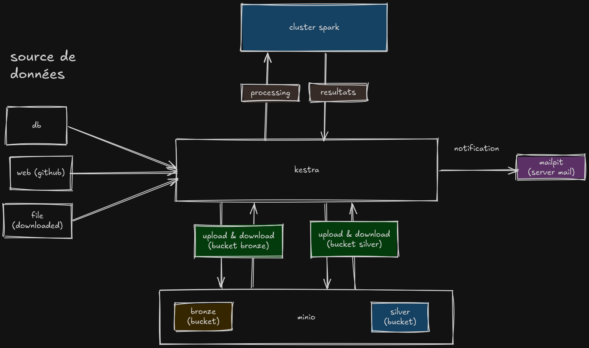
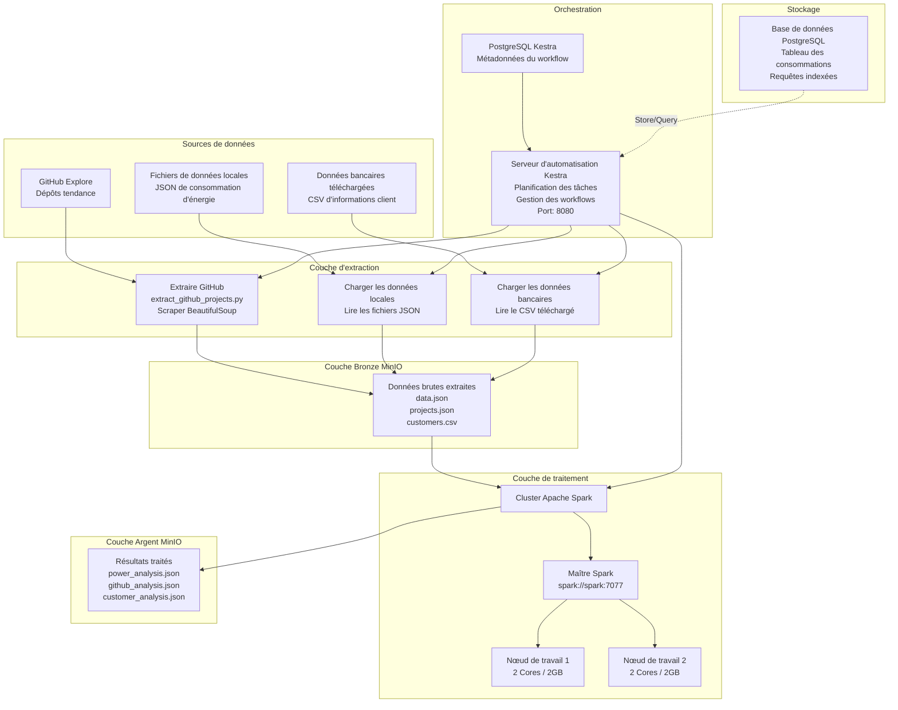

# Projet ETL

## Description du projet

Ce projet est un pipeline ETL automatisé qui extrait, transforme et analyse des données provenant de multiples sources. Le pipeline collecte les données de consommation d'énergie, les dépôts GitHub tendance, et les données bancaires clients d'Internet, les traite à l'aide d'Apache Spark, et stocke les résultats pour une analyse ultérieure.



## Stack technologique

- **Docker**: Conteneurisation
- **Kestra**: Plateforme d'automatisation
- **Spark**: Traitement des données
- **Minio**: Stockage
- **Mailpit**: Test et débogage des courriers électroniques

## Comment exécuter

### Configuration initiale

Créez le réseau Docker requis :

```bash
docker network create etl-net
```

### Démarrer la pile

Lancez tous les services :

```bash
docker compose up -d
```

### Accéder aux plateformes

Une fois tous les conteneurs en cours d'exécution, accédez aux interfaces Web :

- **Tableau de bord Kestra**: <http://localhost:8080>
- **Interface Web Spark**: <http://localhost:30081/>
- **Console MinIO**: <http://localhost:9001>
- **Interface de courrier Mailpit**: <http://localhost:8025>

### Identifiants

```yaml
kestra:
  email: admin@local.host
  password: Password123!

minio:
  username: minio
  password: minio_password
```

## Sources de données

Le système traite les données provenant de trois sources principales :

1. **Données de consommation d'énergie locales** - Enregistrements historiques de consommation d'énergie pour trois zones avec des métriques environnementales incluant la température, l'humidité, la vitesse du vent et les flux diffus solaires.

2. **Page GitHub Explore** - Dépôts GitHub tendance extraits en temps réel pour identifier les projets open-source populaires, leurs langages de programmation, thèmes et fréquence de mise à jour.

3. **Données des clients bancaires téléchargées** - Informations client téléchargées à partir de sources Internet contenant les profils clients, les scores de crédit, la géographie, l'âge, l'ancienneté, le solde et le statut de désabonnement.

## Comment les données sont traitées

Les données circulent dans le système en étapes distinctes :

1. **Extraction** - Les données provenant de sources externes sont extraites à l'aide de scripts Python. Les données GitHub sont extraites avec BeautifulSoup. Les fichiers locaux et les données client téléchargées sont lus directement. Toutes les données brutes vont au compartiment bronze MinIO.

2. **Traitement** - Les données du compartiment bronze sont traitées par le cluster Apache Spark. Spark transforme les données brutes, extrait les fonctionnalités, agrège les statistiques et effectue les calculs. Plusieurs nœuds de travail gèrent le calcul en parallèle.

3. **Résultats de l'analyse** - Les données traitées sont enregistrées dans le compartiment argent MinIO sous forme de fichiers d'analyse. Ces fichiers contiennent des statistiques finales, des classements, des tendances et des prédictions prêts pour les insights.

4. **Orchestration** - Kestra gère l'ensemble du workflow, planifie les extractions, déclenche les travaux Spark, surveille la fin et gère les défaillances.

## Architecture du système

L'infrastructure complète se compose de plusieurs services interconnectés travaillant ensemble pour gérer l'ensemble du pipeline de données :



## Structure de stockage MinIO

Les données sont organisées dans MinIO par type et date pour un suivi et une récupération faciles.

### Compartiment Bronze

Données brutes extraites de toutes les sources stockées par date. Aucune transformation appliquée.

**Données des clients bancaires**

- Chemin: `file/{YYYY-MM-DD}/data.json`
- Source: Téléchargé d'Internet (CSV converti en JSON)
- Mis à jour: Quotidiennement

**Données de consommation d'énergie**

- Chemin: `db/{YYYY-MM-DD}/data.json`
- Source: Base de données PostgreSQL
- Mis à jour: Quotidiennement

**Données des projets GitHub**

- Chemin: `web/{YYYY-MM-DD}/data.json`
- Source: Page GitHub explore (scraper BeautifulSoup)
- Mis à jour: Quotidiennement

### Compartiment Argent

Données traitées et analysées prêtes pour les insights, organisées par type et date.

**Analyse de l'énergie**

- Chemin: `db/{YYYY-MM-DD}/data.json`
- Sortie de: `process_db_spark` (traitement Spark)
- Contient: 15 analyses incluant les totaux par zone, les modèles horaires, les extrêmes de température par mois, les heures de consommation de pointe

**Analyse client**

- Chemin: `file/{YYYY-MM-DD}/data.json`
- Sortie de: `process_file_spark` (traitement Spark)
- Contient: Analyse du désabonnement, segmentation client par score de crédit, répartition démographique par géographie

**Analyse GitHub**

- Chemin: `web/{YYYY-MM-DD}/data.json`
- Sortie de: `process_web_spark` (traitement Spark)
- Contient: Classement des dépôts par étoiles, distribution des langages, scores tendance

Chaque fichier est organisé par date (YYYY-MM-DD) pour maintenir les données historiques et permettre une restauration si nécessaire. L'approche à deux niveaux permet de reconstruire l'argent à partir du bronze si la logique de traitement change, tout en maintenant la traçabilité compète des données et la piste d'audit.
